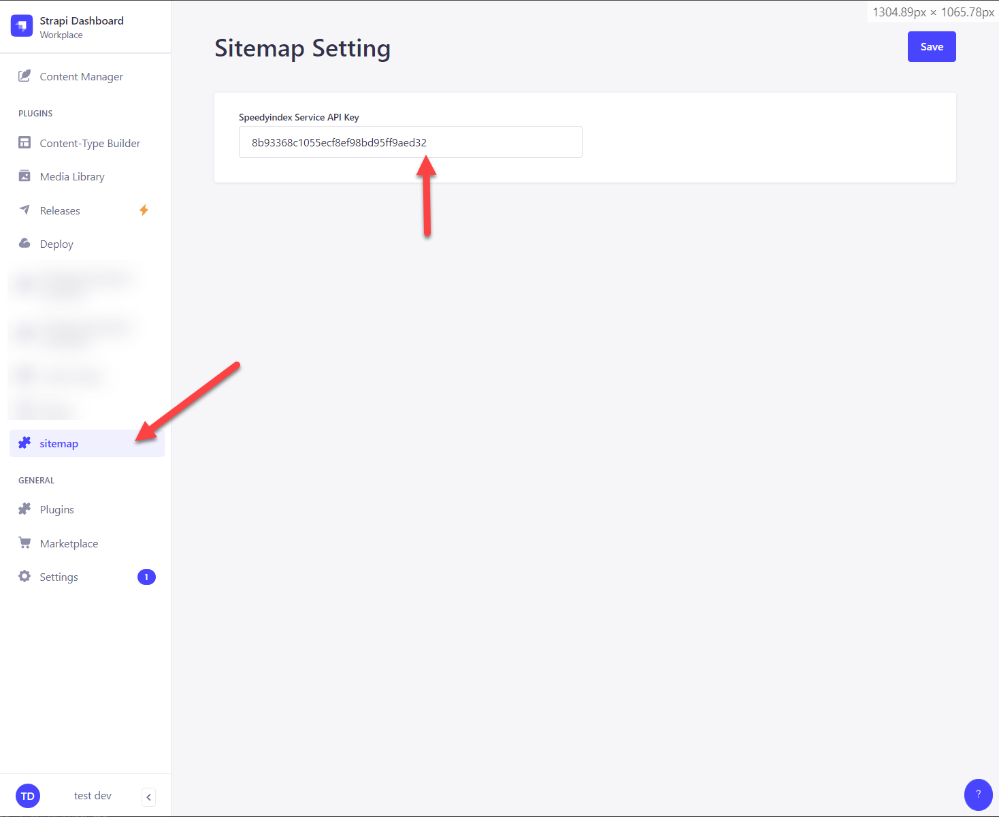

# Strapi plugin sitemap

## Integrate with strapi project
Update `config/plugins.js` to enable sitemap plugin.

```js
module.exports = () => ({
  sitemap: {
    enabled: true
  }
});
```

## Speedy Index service API key
Set the speedyindex service API key on sitemap setting on Strapi Admin



## Provided API

- ### Fetch Sitemap - ``[GET]{{serverURL}}/sitemap/sitemap``

This is the endpoint to create custom blog posts.
<br> Example response
```json
{
  "page": 1,
  "pageSize": 100,
  "total": 1,
  "results": [
    {
      "link": "http://example.com/articles/example",
      "label": "Lorem Ipsum"
    }
  ]
}

```

